# 📰 Projeto ONG Patinhas Seguras

- Este é um sistema de gerenciamento de conteúdo para uma ONG de animais de rua.  
- Permite que as pessoas adotem ou coloquem para adoção seus pets e animais em situação de rua.


## 🚀 Tecnologias Utilizadas
- **Frontend:** HTML, CSS, JavaScript  
- **Backend:** Node.js + Express  
- **Banco de Dados:** MySQL  
- **Hospedagem:**  
  - **Frontend:** [GitHub Pages](https://github.com/mikedcf/patinhas-seguras)  
  - **Backend & DB:** [Railway](patinhas-seguras-production.up.railway.app) 
- Site: [Notícias WEB](https://mikedcf.github.io/patinhas-seguras/frontend/html/home.html)

## 📊 Arquitetura

```mermaid
flowchart TD
    subgraph Client["Usuário / Navegador"]
        Browser["🌐 Navegador (HTML, CSS, JS)"]
    end

    subgraph Frontend["Frontend (GitHub Pages)"]
        Pages["GitHub Pages (HTML + CSS + JS)"]
    end

    subgraph Backend["Backend (Railway - Node.js + Express)"]
        API["API REST (server.js)"]
    end

    subgraph Database["Banco de Dados (MySQL - Railway)"]
        DB[("MySQL Database")]
    end

    %% Conexões
    Browser -->|"HTTP/HTTPS Request"| Pages
    Pages -->|"Fetch API / HTTP"| API
    API -->|"SQL Queries"| DB
    DB -->|"Resultados SQL"| API
    API -->|"JSON Response"| Pages
```



## 📂 Estrutura do Projeto
- /frontend → Código do site (HTML, CSS, JS)
- /backend → API em Node.js + Express
    - /backend/js/server.js → Ponto de entrada
    - /backend/js/db.js → Conexão com o banco
    - /backend/js/controllers.js → Lógica da aplicação
    - /backend/sql → Scripts SQL para criação de tabelas

## 🔄 Diagrama de Sequência – Fluxo de Requisição

```mermaid
sequenceDiagram
    participant U as Usuário
    participant F as Frontend (GitHub Pages)
    participant B as Backend (Railway - Node.js)
    participant D as Banco de Dados (MySQL)

    U->>F: Acessa site pelo navegador
    F->>B: Requisição HTTP (GET /patinhas-seguras)
    B->>D: Consulta SQL (SELECT * FROM cachorros)
    D-->>B: Retorna resultados
    B-->>F: Resposta JSON com os cachorros/gatos
    F-->>U: Renderiza o carrossel dos animais na tela
```



## 💻 Executando Localmente

### 1. Clonar o repositório
```
git clone https://mikedcf.github.io/patinhas-seguras/
cd patinhas seguras
```
### 2. Configurar Backend
```
cd backend
npm install
```

- Instala as dependencias do `package.json` na pasta `backend/`.

### 3. Criar arquivo .env (Exemplo)

```
DB_HOST=localhost
DB_PORT=3306
DB_USER=root
DB_PASSWORD=""
DB_DATABASE=patinhas
SERVER_PORT=3000
FRONTEND_URL="http://localhost"
```

### 4. Rodar o servidor

```
npm start
ou
node --require dotenv/config js/server.js
```
### A API estará disponível em:

    > http://localhost:3000


## 🌍 Deploy em Produção

### 🔑 Variáveis de Ambiente

No Railway, configure as seguintes variáveis:

- DB_HOST
- DB_PORT
- DB_USER
- DB_PASSWORD
- DB_NAME
- PORT

## 📈 Roadmap / Melhorias Futuras

- Sistema de cadastro/login para usuários → tutores e adotantes podem gerenciar seus animais, acompanhar solicitações e editar perfis.
- Chat direto → adotante consegue conversar com o doador/ONG dentro do site.
- Agendamento online → marcar visitas ou entrevistas para conhecer o animal.

## Extenssões Usadas

- `Material Icon Theme` - Tema dos arquivos de das pastas.
- `Live Server` - Hospedar o projeto no localhost.
- `Live Preview` - Possibilita a pré-visualização do arquivo HTML.
- `Code Runner` - Executa o arquivo js no terminal.

## Atalhos HMTL Semântico

- `.<nome>` - Cria uma div genérica com a classe "nome".
- `section.<nome>` - Cria uma section com a classe "nome".
- `section#<nome>` - Cria uma section com o id "nome".
- `section.<nome1>#<nome2>` - Cria uma section com classe "nome1" e id "nome2".

## Atalhos VSCode

- `(Alt + Shift + i)` - Habilita edição em todas as linhas selecionadas.
- `(Ctrl + F2)` - Seleciona e habilita edição em todas as ocorrências de mesma sequência do conteudo selecionado.
- `(Ctrl + ;)` - Comenta o conteúdo selecionado.
- `(Alt + Z)` - Quebra de linha.

## Referências de Desenvolvimento

- https://developer.mozilla.org/pt-BR/
- https://www.w3schools.com/

## Git Config Utils

- git config --global user.email "you@example.com"
- git config --global user.name "Your Name"